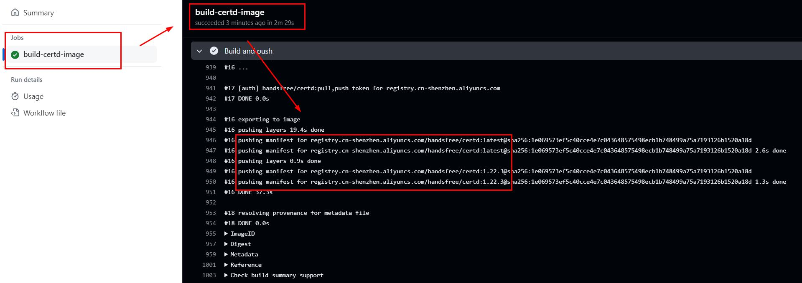

# Certd

Certd 是一个免费全自动申请和自动部署更新SSL证书的工具。       
后缀d取自linux守护进程的命名风格，意为证书守护进程。    

关键字：证书自动申请、证书自动更新、证书自动续期、证书自动续签

************************
支持开源，为爱发电，我已入驻爱发电   
https://afdian.com/a/greper

发电权益：
1. 可加入发电专属群，可以获得作者一对一技术支持
2. 您的需求我们将优先实现，并且将作为专业版功能提供
3. 一年期专业版激活码
4. 赠送免费服务器部署方案（0成本使用Certd）

专业版特权
1. 证书流水线条数无限制（免费版限制10条）
2. 免配置发邮件功能
3. 更多功能增加中...
************************

## 一、特性
本项目不仅支持证书申请过程自动化，还可以自动化部署更新证书，让你的证书永不过期。     

* 全自动申请证书（支持阿里云、腾讯云、华为云、Cloudflare等各种途径注册的域名）
* 全自动部署更新证书（目前支持部署到主机、部署到阿里云、腾讯云等）
* 支持通配符域名/泛域名，支持多个域名打到一个证书上
* 邮件通知
* 私有化部署，保障安全
* 免费、免费、免费（[阿里云单个通配符域名证书最便宜也要1800/年](https://yundun.console.aliyun.com/?p=cas#/certExtend/buy/cn-hangzhou)）


## 二、在线体验

官方Demo地址，自助注册后体验    

https://certd.handsfree.work/

> 注意数据将不定期清理，不定期停止定时任务，生产使用请自行部署    
> 包含敏感信息，务必自己本地部署进行生产使用

## 三、使用教程
本案例演示，如何配置自动申请证书，并部署到阿里云CDN，然后快要到期前自动更新证书并重新部署     


↓↓↓↓↓↓↓↓↓↓↓↓↓↓↓↓↓↓↓↓↓↓↓↓↓↓↓↓↓↓↓↓↓↓↓↓↓↓↓↓      
-------> [点我查看详细使用步骤演示](./step.md)   <--------      
↑↑↑↑↑↑↑↑↑↑↑↑↑↑↑↑↑↑↑↑↑↑↑↑↑↑↑↑↑↑↑↑↑↑↑↑↑↑↑↑     

## 四、私有化部署

由于证书、授权信息等属于高度敏感数据，请务必私有化部署，保障数据安全

### 1. 安装docker、docker-compose

1.1 准备一台云服务器
* 【阿里云】云服务器2核2G，新老用户同享，99元/年，续费同价！【 [立即购买](https://www.aliyun.com/benefit?scm=20140722.M_10244282._.V_1&source=5176.11533457&userCode=qya11txb )】
* 【腾讯云】云服务器2核2G，新老用户同享，99元/年，续费同价！【 [立即购买](https://cloud.tencent.com/act/cps/redirect?redirect=6094&cps_key=b3ef73330335d7a6efa4a4bbeeb6b2c9&from=console)】
  

1.2 安装docker      

https://docs.docker.com/engine/install/   
选择对应的操作系统，按照官方文档执行命令即可   

### 2. 运行certd

[docker-compose.yaml 下载](https://gitee.com/certd/certd/raw/v2/docker/run/docker-compose.yaml)

当前版本号： 

```bash
# 随便创建一个目录
mkdir certd
# 进入目录
cd certd
# 下载docker-compose.yaml文件，或者手动下载放到certd目录下
wget https://gitee.com/certd/certd/raw/v2/docker/run/docker-compose.yaml

# 可以根据需要修改里面的配置
# 1.修改镜像版本号【可选】
# 2.配置数据保存路径【可选】
# 3.修改端口号【可选】
vi docker-compose.yaml # 【可选】

# 启动certd
docker compose up -d

```
> 如果提示 没有compose命令,请安装docker-compose   
> https://docs.docker.com/compose/install/linux/

#### 镜像说明：
* 国内镜像地址:
  * `registry.cn-shenzhen.aliyuncs.com/handsfree/certd:latest`
* DockerHub地址：
  * `https://hub.docker.com/r/greper/certd`
  * `docker pull greper/certd:latest`

* 镜像构建通过`Actions`自动执行，过程公开透明，请放心使用
  * [点我查看镜像构建日志](https://github.com/certd/certd/actions/workflows/build-image.yml) 




### 3. 访问

http://your_server_ip:7001    
默认账号密码：admin/123456    
记得修改密码   


## 五、 升级
如果使用固定版本号
1. 修改`docker-compose.yaml`中的镜像版本号
2. 运行`docker compose up -d` 即可

如果使用`latest`版本
```shell
#重新拉取镜像
docker pull registry.cn-shenzhen.aliyuncs.com/handsfree/certd:latest
# 重新启动容器
docker compose down
docker compose up -d
```

> 数据默认存在`/data/certd`目录下，不用担心数据丢失   


更新日志： [CHANGELOG](./CHANGELOG.md)


## 六、一些说明
* 本项目ssl证书提供商为letencrypt
* 申请过程遵循acme协议
* 需要验证域名所有权，一般有两种方式（目前本项目仅支持dns-01）
  * http-01： 在网站根目录下放置一份txt文件
  * dns-01： 需要给域名添加txt解析记录，通配符域名只能用这种方式
* 证书续期：
  * 实际上没有办法不改变证书文件本身情况下直接续期或者续签。
  * 我们所说的续期，其实就是按照全套流程重新申请一份新证书，然后重新部署上去。
* 免费证书过期时间90天，以后可能还会缩短，所以自动化部署必不可少
* 设置每天自动运行，当证书过期前20天，会自动重新申请证书并部署


## 七、不同平台的设置说明

* [Cloudflare](./doc/cf/cf.md)
* [腾讯云](./doc/tencent/tencent.md)
* [windows主机](./doc/host/host.md)
* [google证书](./doc/google/google.md)


## 八、问题处理
### 7.1 忘记管理员密码   
解决方法如下：
1. 修改docker-compose.yaml文件，将环境变量`certd_system_resetAdminPassword`改为`true`
```yaml
services:
  certd:
    environment: # 环境变量
      - certd_system_resetAdminPassword=false
```
2. 重启容器
```shell
docker compose up -d
docker logs -f --tail 500 certd
# 观察日志，当日志中输出“重置1号管理员用户的密码完成”，即可操作下一步
```
3. 修改docker-compose.yaml，将`certd_system_resetAdminPassword`改回`false`
4. 再次重启容器
```shell
docker compose up -d
```
5. 使用`admin/123456`登录系统，请及时修改管理员密码

## 九、联系作者
如有疑问，欢迎加入群聊（请备注certd）
* QQ群：141236433
* 微信群：   
  


加作者好友
<p align="center">

</p>

## 十、捐赠
支持开源，为爱发电，我已入驻爱发电   
https://afdian.com/a/greper

发电权益：
1. 可加入发电专属群（先加我好友，发送发电截图，我拉你进群）
2. 你的需求优先实现
3. 可以获得作者一对一技术支持
4. 更多权益陆续增加中...


## 十一、贡献代码

1.  [贡献插件教程](./plugin.md)
2. 作为贡献者，代表您同意您贡献的代码如下许可：
   1. 可以调整开源协议以使其更严格或更宽松。
   2. 可以用于商业用途。

## 十二、 开源许可
* 本项目遵循 GNU Affero General Public License（AGPL）开源协议。   
* 允许个人和公司使用、复制、修改和分发本项目，禁止任何形式的商业用途 
* 未获得商业授权情况下，禁止任何对logo、版权信息及授权许可相关代码的修改。
* 如需商业授权，请联系作者。

## 十三、我的其他项目（求Star）
* [袖手GPT](https://ai.handsfree.work/) ChatGPT，国内可用，无需FQ，每日免费额度
* [fast-crud](https://gitee.com/fast-crud/fast-crud/) 基于vue3的crud快速开发框架
* [dev-sidecar](https://github.com/docmirror/dev-sidecar/) 直连访问github工具，无需FQ，解决github无法访问的问题


## 十四、更新日志

更新日志：[CHANGELOG](./CHANGELOG.md)


