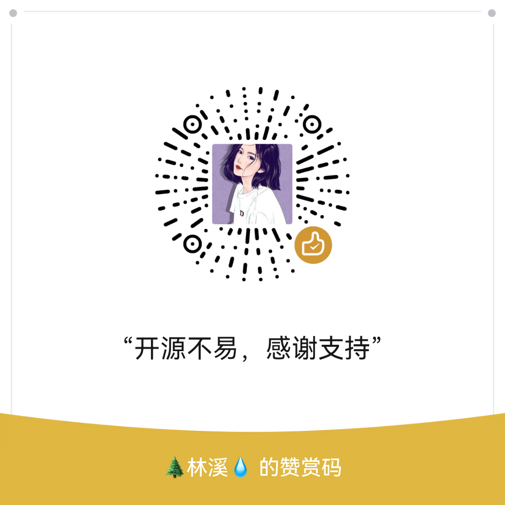

# CertD

CertD 是一个免费全自动申请和部署SSL证书的工具。       
后缀D取自linux守护进程的命名风格，意为证书守护进程。    

## 一、特性
本项目不仅支持证书申请过程自动化，还可以自动化部署证书，让你的证书永不过期。     

* 全自动申请证书（支持阿里云、腾讯云、华为云、Cloudflare注册的域名）
* 全自动部署证书（目前支持服务器上传部署、部署到阿里云、腾讯云等）
* 支持通配符域名
* 支持多个域名打到一个证书上
* 邮件通知
* 证书自动更新
* 免费、免费、免费（[阿里云单个通配符域名证书最便宜也要1800/年](https://yundun.console.aliyun.com/?p=cas#/certExtend/buy/cn-hangzhou)）


## 二、在线体验

官方Demo地址，自助注册后体验    

https://certd.handsfree.work/

> 注意数据将不定期清理，生产使用请自行部署    
> 包含敏感信息，务必自己本地部署进行生产使用

## 三、使用教程
本案例演示，如何配置自动申请证书，并部署到阿里云CDN，然后快要到期前自动更新证书并重新部署     


↓↓↓↓↓↓↓↓↓↓↓↓↓↓↓↓↓↓↓↓↓↓↓↓↓↓↓↓↓↓↓↓↓↓↓↓↓↓↓↓      
-------> [点我查看详细使用步骤演示](./step.md)   <--------      
↑↑↑↑↑↑↑↑↑↑↑↑↑↑↑↑↑↑↑↑↑↑↑↑↑↑↑↑↑↑↑↑↑↑↑↑↑↑↑↑     

## 四、本地docker部署

### 1. 安装docker、docker-compose

1.1 准备一台云服务器
* 【阿里云】云服务器2核2G，新老用户同享，99元/年，续费同价！【 [立即购买](https://www.aliyun.com/benefit?scm=20140722.M_10244282._.V_1&source=5176.11533457&userCode=qya11txb )】
* 【腾讯云】云服务器2核2G，新老用户同享，99元/年，续费同价！【 [立即购买](https://cloud.tencent.com/act/cps/redirect?redirect=6094&cps_key=b3ef73330335d7a6efa4a4bbeeb6b2c9&from=console)】
  

1.2 安装docker    
https://docs.docker.com/engine/install/
选择对应的操作系统，按照官方文档执行命令即可


### 2. 下载docker-compose.yaml文件

[docker-compose.yaml下载](https://gitee.com/certd/certd/raw/v2/docker/run/docker-compose.yaml)

```bash
mkdir certd
cd certd
# wget下载docker-compose.yaml文件
wget https://raw.githubusercontent.com/certd/certd/v2/docker/run/docker-compose.yaml
# 或者使用gitee地址
wget https://gitee.com/certd/certd/raw/v2/docker/run/docker-compose.yaml

# 根据需要修改里面的配置
# 1.修改镜像版本号【可选】
# 2.配置数据保存路径【可选】
# 3.配置certd_auth_jwt_secret【必须】
vi docker-compose.yaml


```
> 镜像版本号与release版本号同步：    
https://github.com/certd/certd/releases


### 3. 运行
```bash
# 如果docker compose是插件化安装
export CERTD_VERSION=latest
docker compose up -d
```
如果提示 没有compose命令,请安装docker-compose   
https://docs.docker.com/compose/install/linux/


### 4. 访问

http://your_server_ip:7001 
默认账号密码：admin/123456 
记得修改密码


### 5. 升级

* 修改版本号，重新运行 `docker compose up -d` 即可
* 数据存在`/data/certd`目录下，不用担心数据丢失


## 五、一些说明
* 本项目ssl证书提供商为letencrypt
* 申请过程遵循acme协议
* 需要验证域名所有权，一般有两种方式（目前本项目仅支持dns-01）
  * http-01： 在网站根目录下放置一份txt文件
  * dns-01： 需要给域名添加txt解析记录，通配符域名只能用这种方式
* 证书续期：
  * 实际上acme并没有续期概念。
  * 我们所说的续期，其实就是按照全套流程重新申请一份新证书。
* 免费证书过期时间90天，以后可能还会缩短，所以自动化部署必不可少
* 设置每天自动运行，当证书过期前20天，会自动重新申请证书并部署

## 六、不同平台的设置说明

* [Cloudflare](./doc/cf/cf.md)
* [腾讯云](./doc/tencent/tencent.md)
* [windows主机](./doc/host/host.md)


## 七、问题处理
### 7.1 忘记管理员密码   
解决方法如下：
1. 修改docker-compose.yaml文件，将环境变量`certd_system_resetAdminPassword`改为`true`
```yaml
services:
  certd:
    environment: # 环境变量
      - certd_system_resetAdminPassword=false
```
2. 重启容器
```shell
docker compose up -d
docker logs -f --tail 500 certd
# 观察日志，当日志中输出“重置1号管理员用户的密码完成”，即可操作下一步
```
3. 修改docker-compose.yaml，将`certd_system_resetAdminPassword`改回`false`
4. 再次重启容器
```shell
docker compose up -d
```
5. 使用admin/123456登录系统，请及时修改管理员密码

## 八、联系作者
如有疑问，欢迎加入群聊（请备注certd）
* QQ群：141236433
* 微信群：   
  


加作者好友
<p align="center">

</p>

## 九、捐赠
媳妇儿说：“一天到晚搞开源，也不管管老婆孩子！😡😡😡”        
拜托各位捐赠支持一下，让媳妇儿开心开心，我也能有更多时间进行开源项目，感谢🙏🙏🙏
<p align="center">

</p>


## 十、贡献代码

[贡献插件教程](./plugin.md)


## 十一、我的其他项目
* [袖手GPT](https://ai.handsfree.work/) ChatGPT，国内可用，无需FQ，每日免费额度
* [fast-crud](https://gitee.com/fast-crud/fast-crud/) 基于vue3的crud快速开发框架
* [dev-sidecar](https://github.com/docmirror/dev-sidecar/) 直连访问github工具，无需FQ，解决github无法访问的问题


## 十二、版本更新日志
https://github.com/certd/certd/blob/v2/CHANGELOG.md