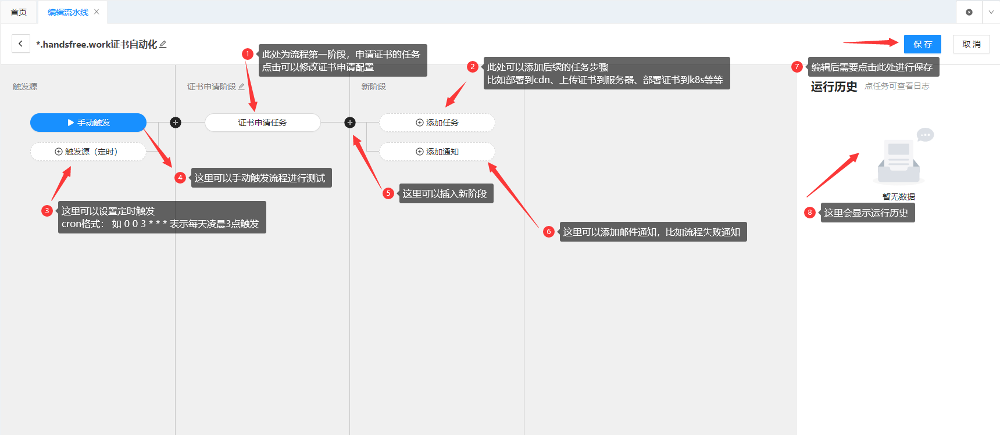
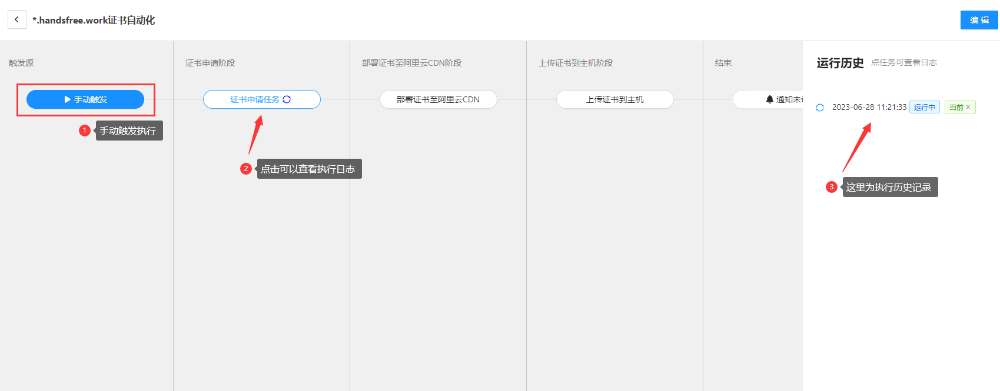
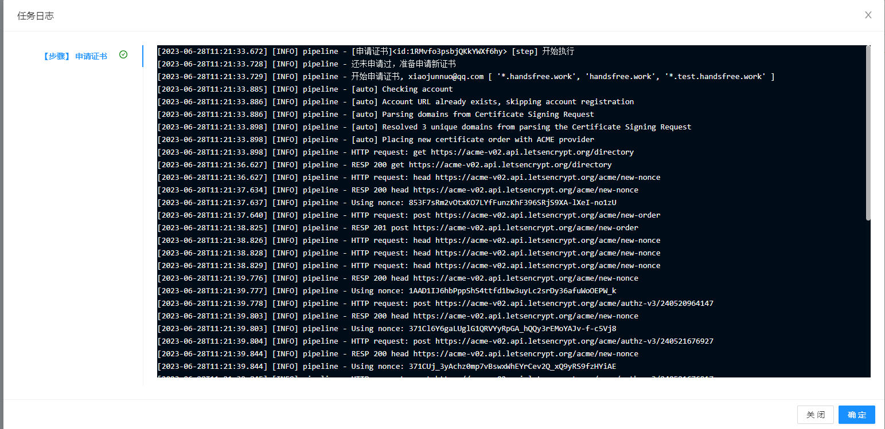
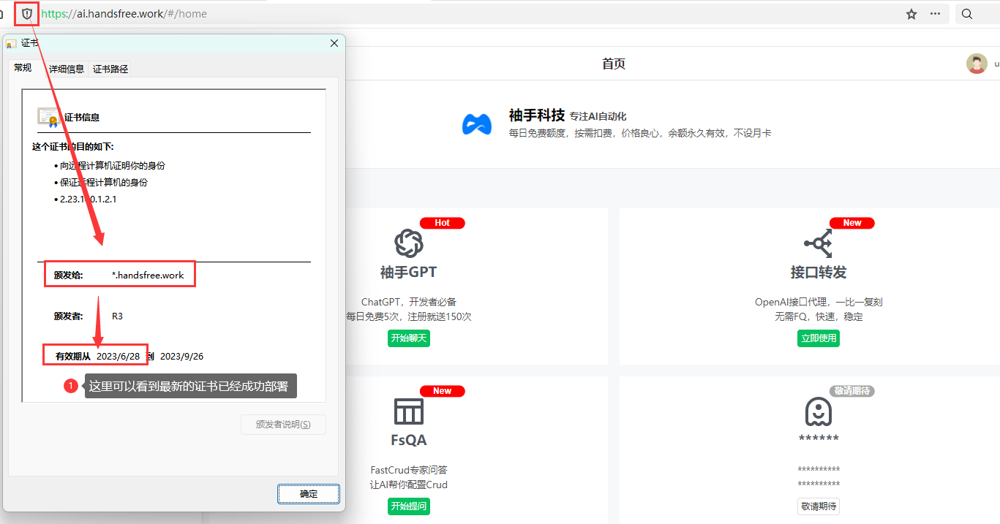
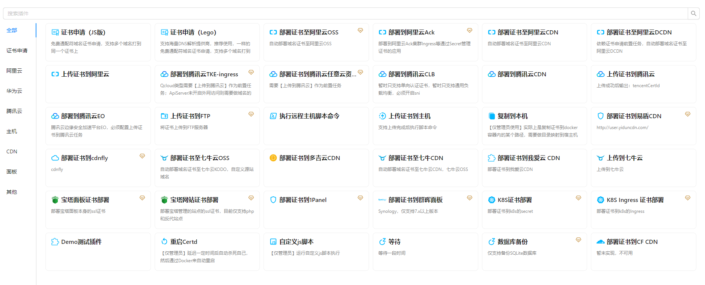

# Certd

Certd 是一个免费全自动申请和自动部署更新 SSL 证书的管理系统。  
后缀 d 取自 linux 守护进程的命名风格，意为证书守护进程。

关键字：证书自动申请、证书自动更新、证书自动续期、证书自动续签、证书管理工具

## 一、特性

本项目不仅支持证书申请过程自动化，还可以自动化部署更新证书，让你的证书永不过期。

- 全自动申请证书（支持所有注册商注册的域名）
- 全自动部署更新证书（目前支持部署到主机、部署到阿里云、腾讯云等，目前已支持 30+部署插件）
- 支持通配符域名/泛域名，支持多个域名打到一个证书上
- 邮件通知
- 私有化部署，数据保存本地，镜像由 Github Actions 构建，过程公开透明
- 支持 sqlite，postgresql 数据库

## 二、在线体验

官方 Demo 地址，自助注册后体验

https://certd.handsfree.work/

> 注意数据将不定期清理，不定期停止定时任务，生产使用请自行部署  
> 包含敏感信息，务必自己本地部署进行生产使用

## 三、使用教程

更多教程请访问文档网站 [certd.docmirror.cn](https://certd.docmirror.cn/)

本案例演示，如何配置自动申请证书，并部署到阿里云 CDN，然后快要到期前自动更新证书并重新部署







↓↓↓↓↓↓↓↓↓↓↓↓↓↓↓↓↓↓↓↓↓↓↓↓↓↓↓↓↓↓↓↓↓↓↓↓↓↓↓↓  
-------> [点我查看详细使用步骤演示](./step.md) <--------  
↑↑↑↑↑↑↑↑↑↑↑↑↑↑↑↑↑↑↑↑↑↑↑↑↑↑↑↑↑↑↑↑↑↑↑↑↑↑↑↑

当前支持的部署插件列表


## 四、私有化部署

由于证书、授权信息等属于高度敏感数据，请务必私有化部署，保障数据安全

您可以根据实际情况从如下方式中选择一种方式进行私有化部署：

1. [宝塔面板方式部署](./docs/guide/install/baota/index.md)
2. [1Panel 面板方式部署](./docs/guide/install/1panel/index.md)
3. [Docker 方式部署](./docs/guide/install/docker/index.md)
4. [源码方式部署](./docs/guide/install/source/index.md)

#### Docker 镜像说明：

- 国内镜像地址:
  - `registry.cn-shenzhen.aliyuncs.com/handsfree/certd:latest`
  - `registry.cn-shenzhen.aliyuncs.com/handsfree/certd:armv7`、`[version]-armv7`
- DockerHub 地址：

  - `https://hub.docker.com/r/greper/certd`
  - `greper/certd:latest`
  - `greper/certd:armv7`、`greper/certd:[version]-armv7`

- 镜像构建通过`Actions`自动执行，过程公开透明，请放心使用
  - [点我查看镜像构建日志](https://github.com/certd/certd/actions/workflows/build-image.yml)


## 五、 升级

如果使用固定版本号

1. 修改`docker-compose.yaml`中的镜像版本号
2. 运行`docker compose up -d` 即可

如果使用`latest`版本

```shell
#重新拉取镜像
docker pull registry.cn-shenzhen.aliyuncs.com/handsfree/certd:latest
# 重新启动容器
docker compose down
docker compose up -d
```

> 数据默认存在`/data/certd`目录下，不用担心数据丢失

更新日志： [CHANGELOG](./CHANGELOG.md)

## 六、一些说明

- 本项目 ssl 证书提供商为 letencrypt/Google/ZeroSSL
- 申请过程遵循 acme 协议
- 需要验证域名所有权，一般有两种方式（目前本项目仅支持 dns-01）
  - http-01： 在网站根目录下放置一份 txt 文件
  - dns-01： 需要给域名添加 txt 解析记录，通配符域名只能用这种方式
- 证书续期：
  - 实际上没有办法不改变证书文件本身情况下直接续期或者续签。
  - 我们所说的续期，其实就是按照全套流程重新申请一份新证书，然后重新部署上去。
- 免费证书过期时间 90 天，以后可能还会缩短，所以自动化部署必不可少
- 设置每天自动运行，当证书过期前 20 天，会自动重新申请证书并部署

## 七、不同平台的设置说明

- 已迁移到新的文档网站，请到常见问题章节查看
- [最新文档站链接 https://certd.docmirror.cn](https://certd.docmirror.cn/)

## 八、问题处理

### 7.1 忘记管理员密码

[重置管理员密码方法](https://certd.docmirror.cn/guide/use/forgotpasswd/)

## 九、联系作者

如有疑问，欢迎加入群聊（请备注 certd）

| 加群   | 微信群                                                      | QQ 群                                                       |
| ------ | ----------------------------------------------------------- | ----------------------------------------------------------- |
| 二维码 |  |  |

也可以加作者好友

| 加作者好友 | 微信 QQ                                                     |
| ---------- | ----------------------------------------------------------- |
| 二维码     |  |

## 十、捐赠

---

支持开源，为爱发电，我已入驻爱发电  
https://afdian.com/a/greper

发电权益：

1. 可加入发电专属群，可以获得作者一对一技术支持
2. 您的需求我们将优先实现，并且将作为专业版功能提供
3. 一年期专业版激活码
4. 赠送国外免费服务器部署方案（0 成本使用 Certd，可能需要翻墙，不过现在性能越来越差了）

专业版特权对比

| 功能           | 免费版                             | 专业版                                |
| -------------- | ---------------------------------- | ------------------------------------- |
| 免费证书申请   | 免费无限制                         | 免费无限制                            |
| 自动部署插件   | 阿里云、腾讯云、七牛云、主机部署等 | 支持群晖、宝塔、1Panel 等，持续开发中 |
| 发邮件功能     | 需要配置                           | 免配置                                |
| 证书流水线条数 | 10 条                              | 无限制                                |

---

## 十一、贡献代码

1. 本地开发 [贡献插件教程](https://certd.docmirror.cn/guide/development/)
2. 作为贡献者，代表您同意您贡献的代码如下许可：
  1. 可以调整开源协议以使其更严格或更宽松。
  2. 可以用于商业用途。

## 十二、 开源许可

- 本项目遵循 GNU Affero General Public License（AGPL）开源协议。
- 允许个人和公司使用、复制、修改和分发本项目，禁止任何形式的商业用途
- 未获得商业授权情况下，禁止任何对 logo、版权信息及授权许可相关代码的修改。
- 如需商业授权，请联系作者。

## 十三、我的其他项目（求 Star）

| 项目名称                                                 | stars                                                                                                 | 项目描述                                                  |
| -------------------------------------------------------- | ----------------------------------------------------------------------------------------------------- | --------------------------------------------------------- |
| [袖手 AI](https://ai.handsfree.work/)                    |                                                                                                       | 袖手 GPT，国内可用，无需 FQ，每日免费额度                 |
| [fast-crud](https://gitee.com/fast-crud/fast-crud/)      |    | 基于 vue3 的 crud 快速开发框架                            |
| [dev-sidecar](https://github.com/docmirror/dev-sidecar/) |  | 直连访问 github 工具，无需 FQ，解决 github 无法访问的问题 |

## 十四、更新日志

更新日志：[CHANGELOG](./CHANGELOG.md)
