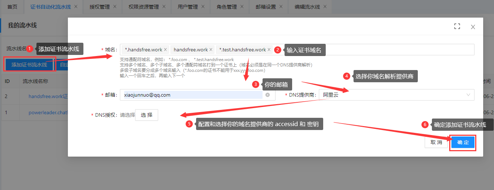
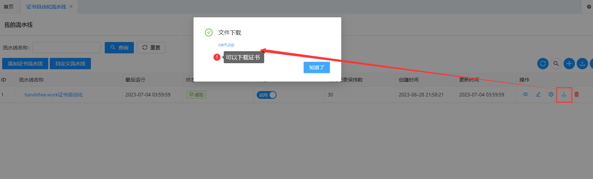
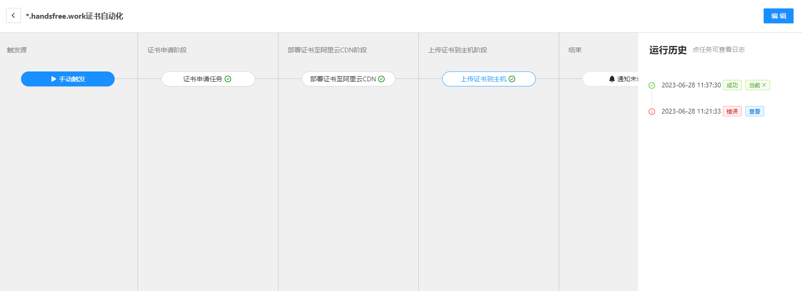
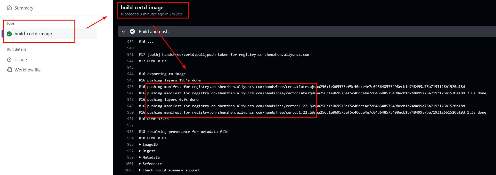
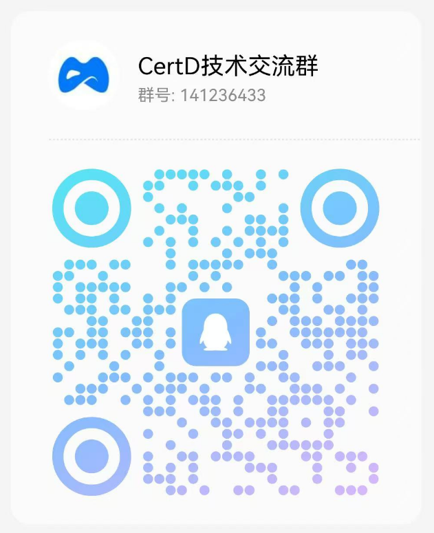

# Certd

[中文](./README.md) | English

Certd® is a free, fully automated certificate management system that ensures your website certificates never expire. The suffix 'd' is inspired by the naming convention of Linux daemons, representing a certificate daemon.

> We pioneered the pipeline-based certificate application and deployment model, which has been "referenced" by multiple projects. Being copied is also a form of success.

> Regarding certificate renewal:
>
> - In fact, it's impossible to renew or reissue a certificate without modifying the certificate file itself.
> - What we refer to as renewal is essentially applying for a new certificate following the full process and redeploying it.
> - Free certificates expire in 90 days, which may be shortened in the future. Therefore, automated deployment is essential.

> The number of pipelines is now unlimited. Welcome to use it.

Official Open Source Address:

[Github](https://github.com/certd/certd)   
[Gitee](https://gitee.com/certd/certd)   
[AtomGit](https://atomgit.com/certd/certd) 

## 1. Features

This project not only supports automated certificate application but also automated certificate deployment and updates, ensuring your certificates never expire.

- Fully automated certificate application (supports domains registered with all registrars and multiple domain verification methods such as DNS-01, HTTP-01, and CNAME proxy).
- Fully automated certificate deployment and updates (currently supports deployment to over 70 plugins, including hosts, Alibaba Cloud, Tencent Cloud, etc.).
- Supports wildcard domains/pan-domains, allows multiple domains in a single certificate, and supports various certificate formats such as pem, pfx, der, and jks.
- Multiple notification methods, including email, webhook, WeChat Work, DingTalk, Lark, and anpush.
- On-premises deployment, local data storage, simple and quick installation. Images are built by Github Actions, with a transparent process.
- Multiple security measures, including authorization encryption, site hiding, 2FA, and password brute-force protection.
- Supports multiple databases such as SQLite, PostgreSQL, MySQL, and MariaDB.
- Open API support.
- Site certificate monitoring.
- Multi-user management.
- Multi-language support (Chinese and English switching).
- Downward compatibility across all versions, with one-click worry-free upgrades.

  

## 2. Online Experience

Visit the official demo site and register to experience it.

https://certd.handfree.work/

> Note: Data will be cleaned up irregularly, and scheduled tasks may be stopped. For production use, please deploy it yourself.
> The content contains sensitive information. Make sure to deploy it locally for production use.

## 3. Usage Tutorial

Just 3 steps to ensure your certificates never expire.

### 1. Create a Certificate Pipeline

> After successful addition, you can directly run the pipeline to apply for a certificate.

### 2. Add a Deployment Task

Normally, we need to deploy certificates to applications. Certd supports a wide range of deployment plugins. You can choose based on your needs, such as deploying to Nginx, Alibaba Cloud, Tencent Cloud, K8S, CDN, Baota, 1Panel, etc.

Here's a demonstration of deploying certificates to a host's Nginx:

If the current deployment plugins don't meet your needs, you can also download them manually and deploy them yourself.

### 3. Run Scheduled Tasks

↓↓↓↓↓↓↓↓↓↓↓↓↓↓↓↓↓↓↓↓↓↓↓↓↓↓↓↓↓↓↓↓↓↓↓↓↓↓↓↓
-------> [Click here to view detailed usage steps](./step.md) <--------
↑↑↑↑↑↑↑↑↑↑↑↑↑↑↑↑↑↑↑↑↑↑↑↑↑↑↑↑↑↑↑↑↑↑↑↑↑↑↑↑

For more tutorials, please visit the official documentation [certd.docmirror.cn](https://certd.docmirror.cn/guide/).

## 4. On-Premises Deployment

Since certificates, authorization information, and other data are highly sensitive, please make sure to deploy them on-premises to ensure data security.

You can choose one of the following deployment methods based on your needs:

1. 【Recommended】[Docker Deployment](https://certd.docmirror.cn/guide/install/docker/)
2. 【Recommended】[BT Panel Deployment](https://certd.docmirror.cn/guide/install/docker/)
3. 【Recommended】[1Panel Deployment](https://certd.docmirror.cn/guide/install/1panel/)
4. 【Recommended】[Rainyun One-Click Deployment](https://app.rainyun.com/apps/rca/store/6646/?ref=NzExMDQ2_): Double your first recharge, only $2.2 per month.
   
5. 【Not Recommended】[Source Code Deployment](https://certd.docmirror.cn/guide/install/source/)

#### Docker Image Information:

**Release channels:**

| Channel | Description |
| --- | --- |
| `stable` / `slim-stable` | **Stable version**, production-ready and fully tested, recommended for production environments |
| `latest` / `slim` / `armv7` | **Preview version**, latest development build with newest features but potentially less stable |

**Image tags:**

| Channel | Tag | Versioned Tag | Base System | Description |
| --- | --- | --- | --- | --- |
| **Stable** | `stable` | `[version]-stable` | Alpine Linux | Recommended for production |
| | `slim-stable` | `[version]-slim-stable` | Debian slim | Better DNS resolution compatibility |
| **Preview** | `latest` | `[version]` | Alpine Linux | Default, small image size |
| | `slim` | `[version]-slim` | Debian slim | Better DNS resolution compatibility |
| | `armv7` | `[version]-armv7` | Alpine Linux | ARMv7 architecture |

**Stable version image addresses:**

| Registry | `stable` | `slim-stable` |
| --- | --- | --- |
| Aliyun | `registry.cn-shenzhen.aliyuncs.com/handsfree/certd:stable` | `registry.cn-shenzhen.aliyuncs.com/handsfree/certd:slim-stable` |
| Docker Hub | `greper/certd:stable` | `greper/certd:slim-stable` |
| GitHub Packages | `ghcr.io/certd/certd:stable` | `ghcr.io/certd/certd:slim-stable` |

**Preview version image addresses:**

| Registry | `latest` | `slim` | `armv7` |
| --- | --- | --- | --- |
| Aliyun | `registry.cn-shenzhen.aliyuncs.com/handsfree/certd:latest` | `registry.cn-shenzhen.aliyuncs.com/handsfree/certd:slim` | `registry.cn-shenzhen.aliyuncs.com/handsfree/certd:armv7` |
| Docker Hub | `greper/certd:latest` | `greper/certd:slim` | `greper/certd:armv7` |
| GitHub Packages | `ghcr.io/certd/certd:latest` | `ghcr.io/certd/certd:slim` | `ghcr.io/certd/certd:armv7` |

> For versioned tags, replace tag name with `[version]-tag`, e.g. replace `stable` with `[version]-stable`

- Images are built automatically by `Actions`, with a transparent process. Please use them with confidence.
  - [Click here to view preview version build logs](https://github.com/certd/certd/actions/workflows/release-image.yml)
  - [Click here to view stable version release logs](https://github.com/certd/certd/actions/workflows/stable-release.yml)

> Note:
>
> - The certificates, authorization information, and other data stored in this application are highly sensitive. Please take appropriate security measures.
> - Make sure to use the HTTPS protocol to access this application to avoid man-in-the-middle attacks.
> - Make sure to use a web application firewall to protect this application from attacks such as XSS and SQL injection.
> - Make sure to secure the server itself to prevent database leakage.
> - Make sure to back up your data to avoid data loss.
> - [Click here for more production safety suggestions](https://certd.docmirror.cn/guide/feature/safe/)

## 5. Ecosystem

### 1. Official Client: Certd Client

`Certd Client` is the official Certd certificate deployment client that runs on application servers. It automatically discovers local Nginx, Apache, and IIS sites, retrieves new certificates from Certd, and deploys them locally. It is designed for servers that should not expose SSH or cannot be accessed directly by Certd.

Project Home: [AtomGit](https://atomgit.com/certd/certd-client/) | [GitHub](https://github.com/certd/certd-client/)
Downloads: [AtomGit Releases](https://atomgit.com/certd/certd-client/releases) | [GitHub Releases](https://github.com/certd/certd-client/releases)

### 2. Third-Party Client: SSL-Assistant

`SSL Assistant` is a certificate deployment and management assistant client that runs on hosts. It supports automatic scanning of the host's `Nginx` configuration and pulling certificates from `Certd` for deployment. This tool is very useful when you don't want to expose your SSH host password.

Open-source Address: https://github.com/Youngxj/SSL-Assistant

## 6. More Help

Please visit the official documentation: [https://certd.docmirror.cn/](https://certd.docmirror.cn/guide/).

- Upgrade Method: [Upgrade Guide](https://certd.docmirror.cn/guide/install/upgrade/)
- Common Issues: [Forgot Password](https://certd.docmirror.cn/guide/use/forgotpasswd/)
- Multi-Database: [Multi-Database Configuration](https://certd.docmirror.cn/guide/install/database/)
- Site Security: [Site Security Features](https://certd.docmirror.cn/guide/feature/safe/)
- Changelog: [CHANGELOG](./CHANGELOG.md)

## 7. Contact the Author

If you have any questions, feel free to join the group chat (please mention 'certd' in your message).

| Join Group | WeChat Group                                                | QQ Group                                                    |
| ---------- | ----------------------------------------------------------- | ----------------------------------------------------------- |
| QR Code    |  |  |

You can also add the author as a friend.

| Add Author as Friend | WeChat QQ                                                   |
| -------------------- | ----------------------------------------------------------- |
| QR Code              |  |

## 8. Donation

---

---

Support open-source projects and contribute with love. I've joined Afdian.
https://afdian.com/a/greper

Benefits of Contribution:

1. Join the exclusive contributor group and get one-on-one technical support from the author.
2. Your requests will be prioritized and implemented as professional edition features.
3. Receive a one-year professional edition activation code.

Comparison of Professional Edition Privileges:

| Feature                         | Free Edition                                                                                     | Professional Edition                                                               |
| ------------------------------- | ------------------------------------------------------------------------------------------------ | ---------------------------------------------------------------------------------- |
| Free Certificate Application    | Unlimited for free                                                                               | Unlimited for free                                                                 |
| Number of Domains               | Unlimited                                                                                        | Unlimited                                                                          |
| Number of Certificate Pipelines | Unlimited                                                                                        | Unlimited                                                                          |
| Site Certificate Monitoring     | Limited to 1                                                                                     | Unlimited                                                                          |
| Automatic Deployment Plugins    | Most plugins such as Alibaba Cloud CDN, Tencent Cloud, QiNiu CDN, Host Deployment, Baota, 1Panel | Synology                                                                           |
| Notifications                   | Email, Custom Webhook                                                                            | Email without configuration, WeChat Work, DingTalk, Lark, anpush, ServerChan, etc. |

---

## 9. Contribute Code

1. For local development, please refer to the [Plugin Contribution Guide](https://certd.docmirror.cn/guide/development/).
2. As a contributor, you agree that your contributed code is subject to the following license:
   1. The open-source license can be adjusted to be more or less restrictive.
   2. It can be used for commercial purposes.

Thank you to the following contributors.

## 10. Open-Source License

- This project follows the GNU Affero General Public License (AGPL).
- Individuals and companies are allowed to use, copy, modify, and distribute this project freely for internal use. Any form of commercial use is prohibited without obtaining commercial authorization.
- Without commercial authorization, any modification of the logo, copyright information, and license-related code is prohibited.
- For commercial authorization, please contact the author.

## 11. My Other Projects (Please Star)

| Project Name                                             | Stars                                                                                                 | Project Description                                                                         |
| -------------------------------------------------------- | ----------------------------------------------------------------------------------------------------- | ------------------------------------------------------------------------------------------- |
| [fast-crud](https://gitee.com/fast-crud/fast-crud/)      |    | A fast CRUD development framework based on Vue3.                                            |
| [dev-sidecar](https://github.com/docmirror/dev-sidecar/) |  | A tool to access GitHub directly without a VPN, solving the problem of inaccessible GitHub. |
