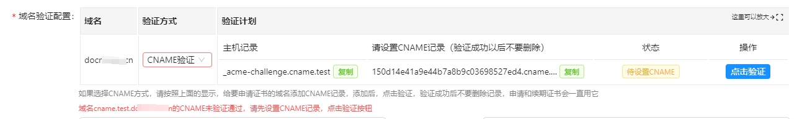
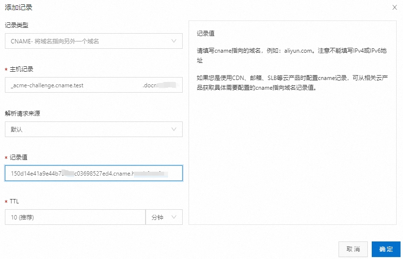

# CNAME代理校验方式说明

## 1. 前言
申请域名证书是需要校验域名所有权的。
目前有两种校验方式：
1. http-01： 在网站根目录下放置一份txt文件（Certd不支持）
2. dns-01： 需要给域名添加txt解析记录，通配符域名只能用这种方式（Certd采用这种方式）

DNS-01方式需要开发适配DNS服务商的接口，目前已实现主流域名注册商的接口（阿里云、腾讯云、华为云、Cloudflare、西数）

如果域名不在这几家，那么就只能通过CNAME代理校验方式来实现

## 2. 使用步骤

1. 假设你要申请证书的域名叫：need.cert.com ,它是在其他服务商注册的
2. 现在你需要另外一个域名：cname.foo.com，这个域名属于是在阿里云、腾讯云、华为云、Cloudflare、西数，或者你把这个域名的DNS服务器转到这几家。
3. 到Certd的 CNAME服务管理界面，用`cname.foo.com`创建一条默认的CNAME服务，需要提供DNS提供商授权。

4. 申请证书时，Certd会生成一个随机的CNAME记录，例如：`_acme-challenge.need`->`xxxxxx.cname.foo.com`
   
5. 您需要手动添加这条CNAME记录到你要申请证书的域名解析中，点击校验，校验成功后就可以开始申请证书了 (此操作每个域名只需要做一次，后续可以重复使用，注意不要删除添加的CNAME记录)
   
6. 
6. 申请过程中，Certd会在`xxxxxx.cname.foo.com`下自动添加验证TXT记录。 
7. 由于您配置了`_acme-challenge.need`的CNAME，所以这个TXT记录会被解析到`_acme-challenge.need.cert.com`下，从而完成域名校验。

