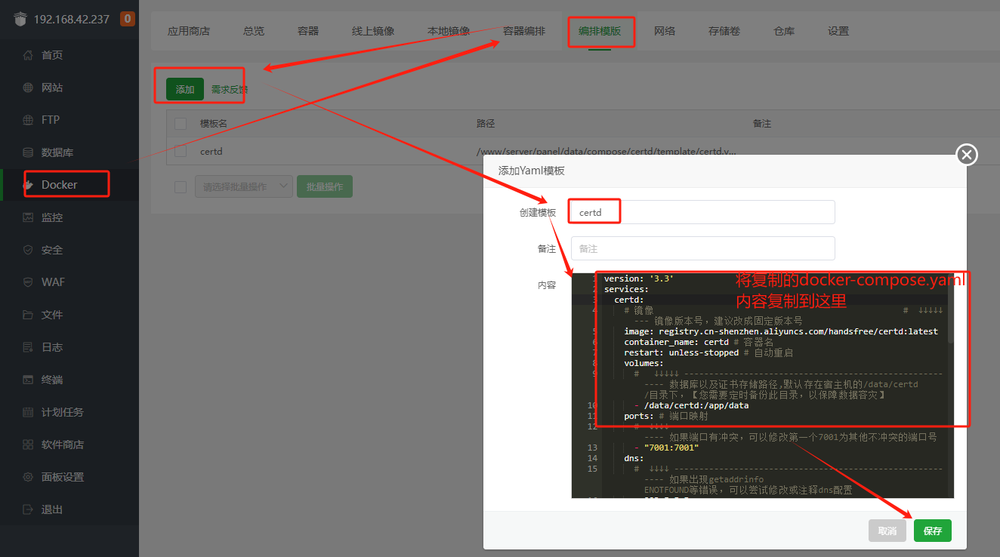
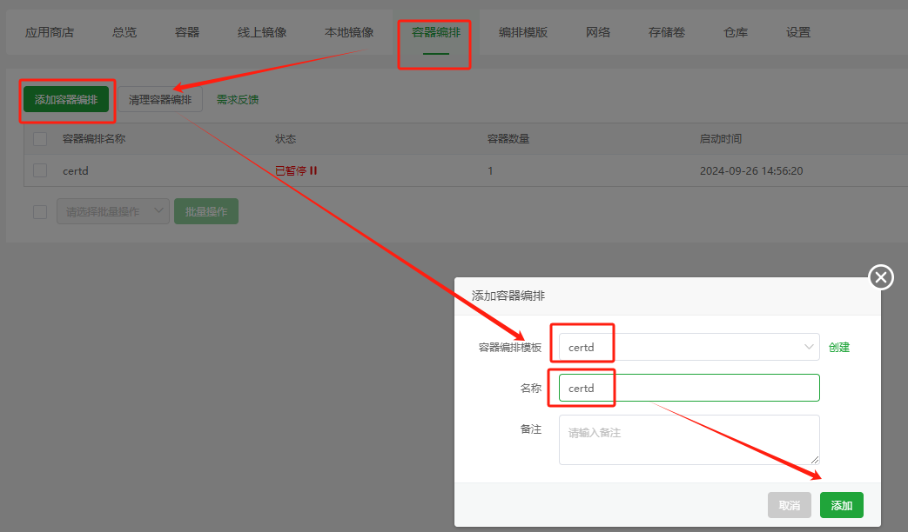

# 宝塔部署教程

## 编排模版部署

### 创建docker模版
打开docker-compose.yaml，
https://gitee.com/certd/certd/raw/v2/docker/run/docker-compose.yaml

整个内容复制下来

然后到宝塔里面进到docker的编排模版，新建模版

### 启动应用

等待启动完成

### 打开应用

http://ip:7001

## 二、一键应用部署
需要宝塔9.2.0版本

### 应用商店
进入应用商店，更新应用列表

### 搜索certd
点击安装