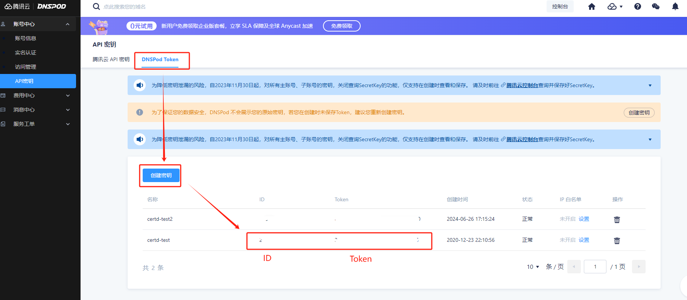
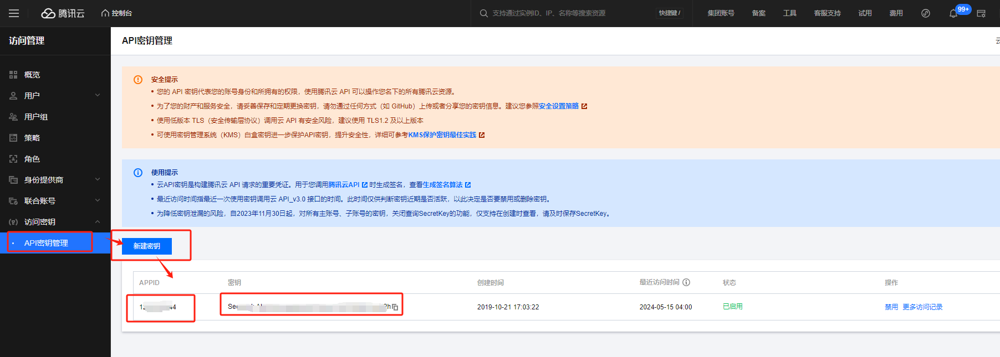

# 腾讯云

## DNSPOD 授权设置
目前腾讯云管理的域名的dns暂时只支持从DNSPOD进行设置    
打开 https://console.dnspod.cn/account/token/apikey    
然后按如下方式获取DNSPOD的授权

## 腾讯云API密钥设置

腾讯云其他部署需要API密钥，需要在腾讯云控制台进行设置   
打开 https://console.cloud.tencent.com/cam/capi   
然后按如下方式获取腾讯云的API密钥    
