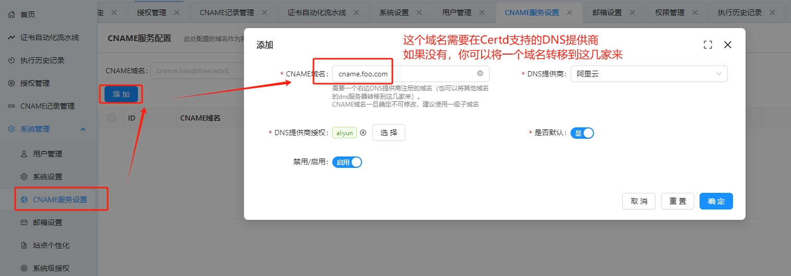
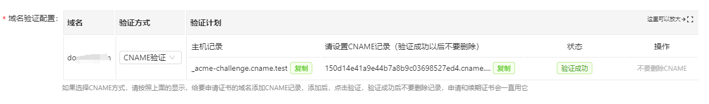

# CNAME代理校验方式

通过CNAME代理校验方式，可以给`Certd`不支持的域名服务商的域名申请证书。

## 1. 前言
* 申请证书是需要`校验域名所有权`的。
* `DNS校验方式`需要开发适配DNS服务商的接口
* 目前`Certd`已实现`主流域名注册商`的接口（阿里云、腾讯云、华为云、Cloudflare、西数）
* 如果域名不在这几家，`DNS校验方式`就行不通
* 那么就只能通过`CNAME代理校验方式`来实现`证书自动申请`

## 2. 原理
* 假设你要申请证书的域名叫：`cert.com` ,它是在`Certd`不支持的服务商注册的
* 假设你还有另外一个域名叫：`proxy.com`，它是在`Certd`支持的服务商注册的。
* 当我们按照如下进行配置时
```
                  CNAME记录（手动、固定）           TXT记录（自动、随机）
_acme-challenge.cert.com ---> xxxxx.cname.proxy.com ----> txt-record-abcdefg
   
```
* 证书颁发机构就可以从`_acme-challenge.cert.com`查到TXT记录 `txt-record-abcdefg`，从而完成域名所有权校验。
* 以上可以看出 `xxxxx.cname.proxy.com ----> txt-record-abcdefg` 这一段`Certd`可以自动添加的。
* 剩下的只需要在你的`proxy.com`域名中手动添加一条固定的`CNAME解析`即可
                         

## 3. Certd CNAME使用步骤

1. 准备`一个`支持的服务商的注册的域名（`proxy.com`），或者将你众多域名其中`一个`的`DNS服务器`转到这几家服务商。
2. 然后到`Certd`的 `CNAME服务管理`界面，用`cname.proxy.com`创建一条默认的CNAME服务，提供DNS提供商授权。
   
2. 然后创建证书流水线，输入`cert.com`，选择`CNAME`校验方式
  
3. 此时需要配置验证计划，Certd会生成一个随机的CNAME记录，例如：`_acme-challenge`->`xxxxxx.cname.proxy.com`
   
3. 您需要手动在你的`cert.com`域名中添加CNAME解析，点击校验，校验成功后就可以开始申请证书了 (此操作每个域名只需要做一次，后续可以重复使用，注意不要删除添加的CNAME记录)
   
   
4. 申请过程中，Certd会在`xxxxxx.cname.proxy.com`下自动添加TXT记录。 


