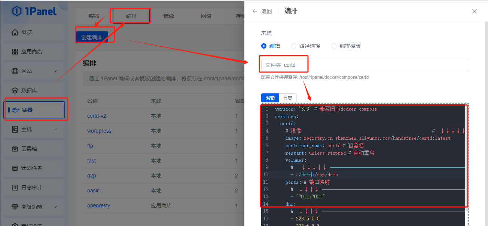
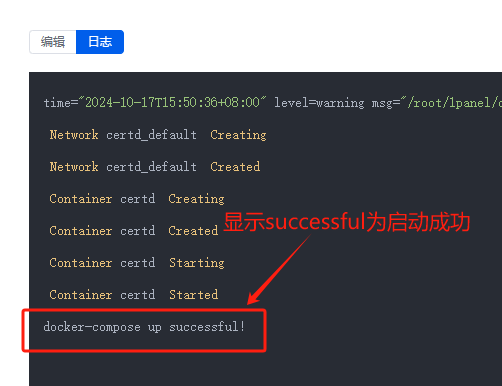
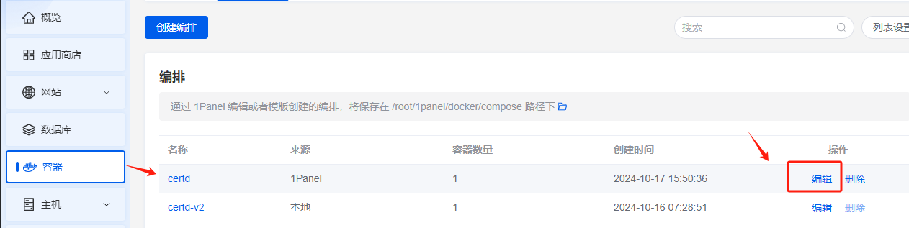
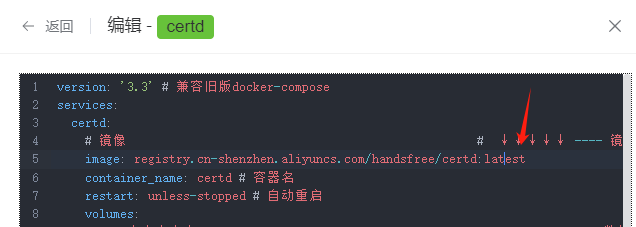

# 部署到1Panel面板

## 一、安装1Panel

https://1panel.cn/docs/installation/online_installation/

## 二、部署certd

1. 打开`docker-compose.yaml`，整个内容复制下来    
   https://gitee.com/certd/certd/raw/v2/docker/run/docker-compose.yaml

2. 然后到 `1Panel->容器->编排->新建编排`
   输入名称，粘贴`docker-compose.yaml`原文内容
   

3. 点击确定，启动容器   
   

> 默认数据保存在`/data/certd`目录下，可以手动备份

3. 访问测试

http://ip:7001

## 三、升级

1. 找到容器，点击编辑
   

2. 将latest修改为最新版本号
   

3. 点击确定，重启容器

## 四、数据备份

> 默认数据保存在`/data/certd`目录下，可以手动备份    
> 建议配置一条 [数据库备份流水线](../../use/backup/)，自动备份
