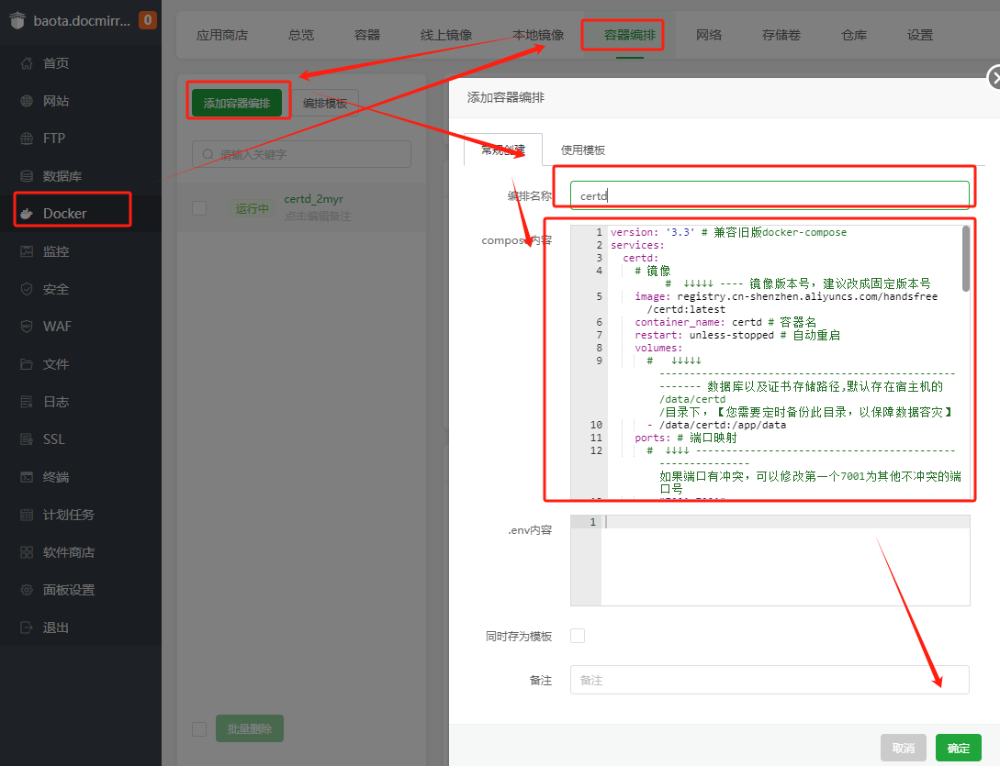
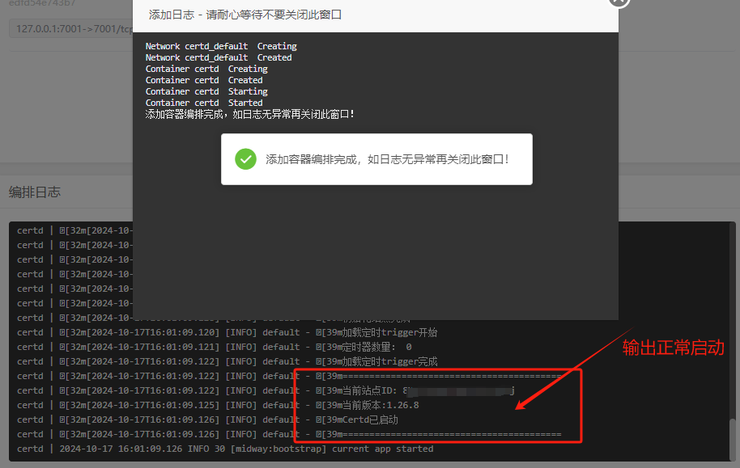
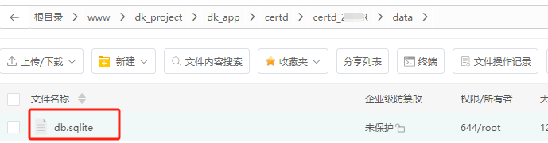

# 部署到宝塔面板


## 一、安装
宝塔面板支持两种方式安装Certd，请选择其中一种方式

### 1、安装宝塔面板

* 安装宝塔面板，前往 [宝塔面板](https://www.bt.cn/u/CL3JHS) 官网，选择`9.2.0`以上正式版的脚本下载安装
* 登录宝塔面板，在菜单栏中点击 Docker，首次进入会提示安装Docker服务，点击立即安装，按提示完成安装

### 2、部署certd

#### 2.1 应用商店一键部署【推荐】

* 在应用商店中找到`certd`（要先点右上角更新应用）
* 点击安装，配置域名等基本信息即可完成安装

> 需要宝塔9.2.0及以上版本才支持

#### 2.2 容器编排部署

1. 打开`docker-compose.yaml`,整个内容复制下来    
   https://gitee.com/certd/certd/raw/v2/docker/run/docker-compose.yaml


然后到宝塔里面进到docker->容器编排->添加容器编排   
   
点击确定，等待启动完成   


## 二、访问应用

http://ip:7001


## 三、如何升级

### 1. 通用方式

先主机上拉取最新镜像，然后面板上重启容器
```shell
docker pull registry.cn-shenzhen.aliyuncs.com/handsfree/certd:latest
```

### 2. 固定版本号方式

修改容器编排模版中的镜像版本号，然后面板上重启容器
```shell
services:
  certd:
    # 镜像                                #  修改最新版本号  ---- ↓↓↓↓↓ 
    image: registry.cn-shenzhen.aliyuncs.com/handsfree/certd:v1.xx.x
```

## 四、数据备份

### 4.1 应用商店部署方式
点击进入安装路径，数据保存在`./data`目录下，可以手动备份




### 4.2 容器编排部署方式

数据默认保存在`/data/certd`目录下，可以手动备份


### 4.3 自动备份

> 建议配置一条 [数据库备份流水线](../backup.md)，自动备份
