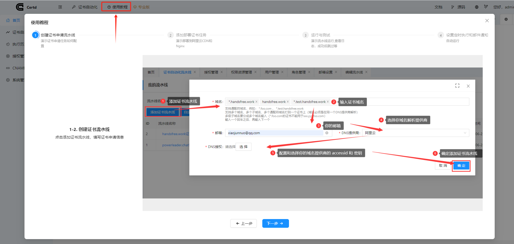

# 演示教程
教程演示从创建证书申请任务到自动部署证书全流程

`申请证书->部署证书->设置定时执行->设置邮件通知`

可以从如下两处查看演示流程

## 1. 系统顶部使用教程菜单
点击`使用教程`可以学习如何自动申请和部署证书

## 2. 图文教程链接
如果不方便登录系统，您还可以直接查看 [图文教程](https://gitee.com/certd/certd/blob/v2/step.md)

