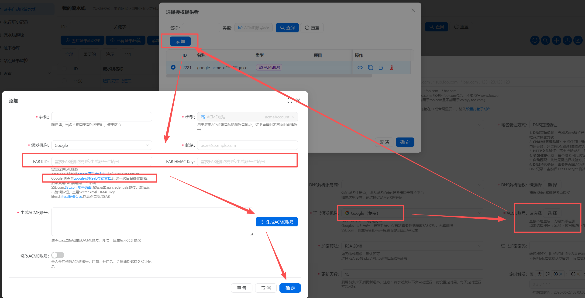

# google证书申请教程

## 1、 添加流水线

 点击“创建证书流水线”按钮

## 2、 生成google ACME账号



## 3、 获取Google EAB

### 3.1、启用API
打开如下链接，启用 API

https://console.cloud.google.com/apis/library/publicca.googleapis.com

打开该链接后点击“启用”，随后等待右侧出现“API已启用”则可以关闭该页。

## 3.2、 创建EAB


1. 打开“Google Cloud Shell”（在右上角点击激活CloudShell图标）。   
等待分配完成后在 Shell 窗口内输入如下命令：
    
```shell
gcloud beta publicca external-account-keys create
```
2. 此时会弹出“为 Cloud Shell 提供授权”，点击授权即可。    
执行完成后会返回类似如下输出；注意不要在没有收到 Google 的邮件时执行该命令，会返回命令不存在。

```shell
Created an external account key
[b64MacKey: xxxxxxxxxxxxxxxx
keyId: xxxxxxxxxxxxx]
```


3. 到Certd中，创建一条EAB授权记录，填写keyId(=kid) 和 b64MacKey 信息      
   注意：keyId没有`]`结尾，不要把`]`也复制了   

## 4、 生成Google ACME账号

注意：EAB授权使用过一次之后，会绑定邮箱，后续再次使用时，要使用相同的邮箱，所以邮箱切记不要修改    
否则会报错 `Unknown external account binding (EAB) key. This may be due to the EAB key expiring which occurs 7 days after creation`

## 5、创建证书流水线，运行流水线申请证书

