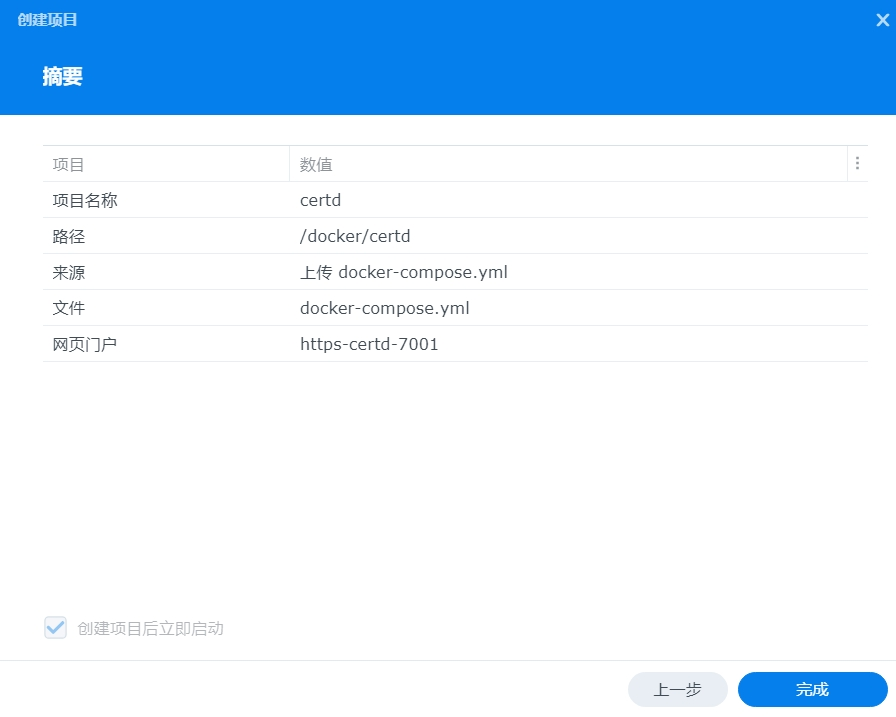
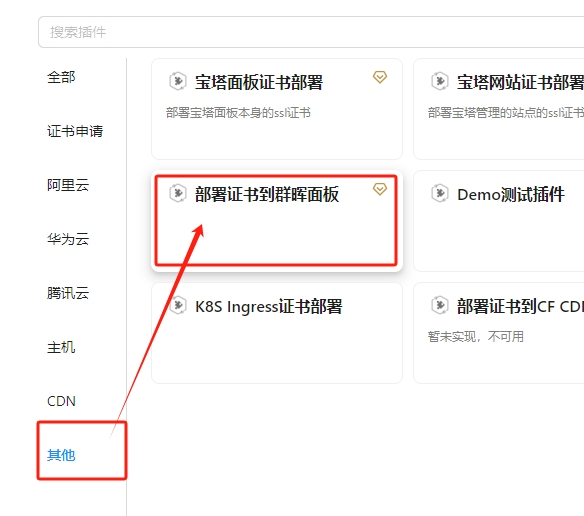
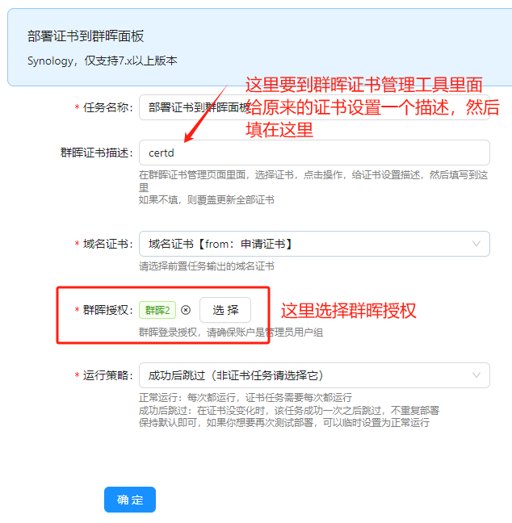
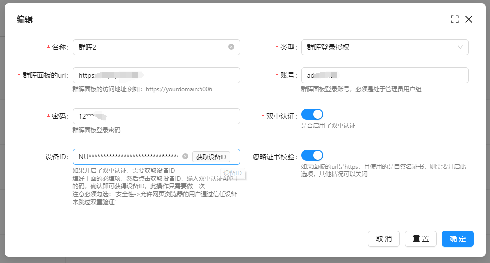
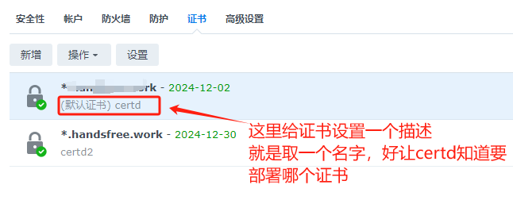
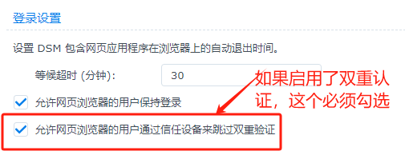
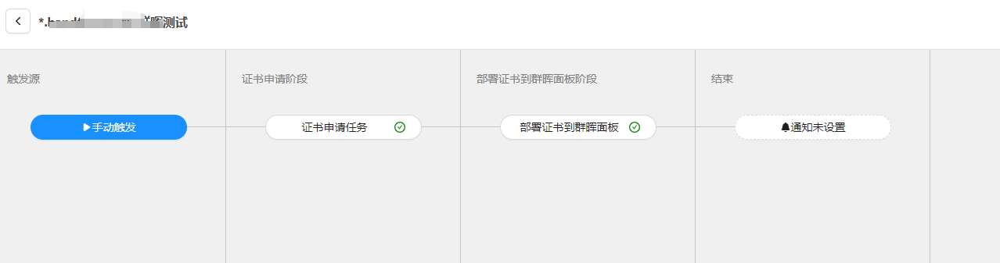
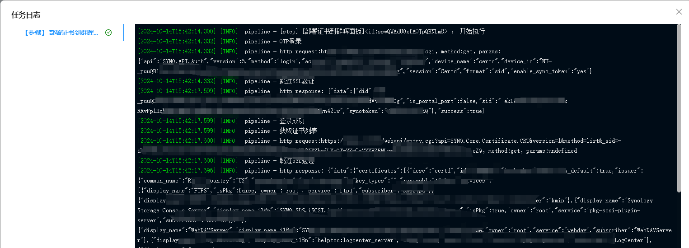
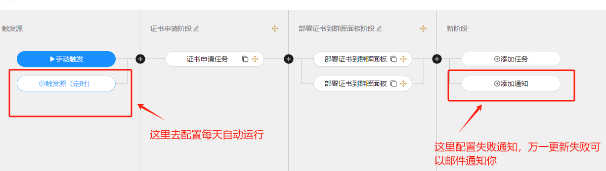

# 群晖部署和证书更新

## 一、群晖部署Certd

### 1. 打开Container Manager

### 2. 新增项目

### 3. 配置Certd项目

### 4. 外网访问设置

### 5. 确认项目信息

点击完成安装，等待certd启动完成即可

### 6. 门户配置向导【可选】

## 二、更新群晖证书

## 1. 前提条件
* 已经部署了certd
* 群晖上已经设置好了证书(证书建议设置好描述，插件需要根据描述查找证书)

## 2. 在certd上配置自动更新群晖证书插件

## 3. 配置任务参数

## 4. 创建授权

> 注意群晖上要做两个设置   

## 5. 运行部署
点击手动运行即可

## 6. 配置通知和自动运行
