# Certd演示示例

本示例演示从创建证书申请任务到自动部署证书全流程

> 申请证书->部署证书->设置定时执行->设置邮件通知

## 准备工作
1. 已部署CertD服务（可官方Demo自助注册体验 https://certd.handsfree.work/ ）
2. 注册一个域名（支持阿里云万网、腾讯云DnsPod、华为云）
3. 准备好以上DNS解析服务商的AccessKey 和 AccessSecret
4. 证书要部署的目标（可选，单纯当成证书申请工具用也不错）

## 自动化流水线创建

### 1. 创建证书申请部署流水线

需要添加域名的DNS解析服务商的授权

填写accessKey和accessSecret

流水线创建成功
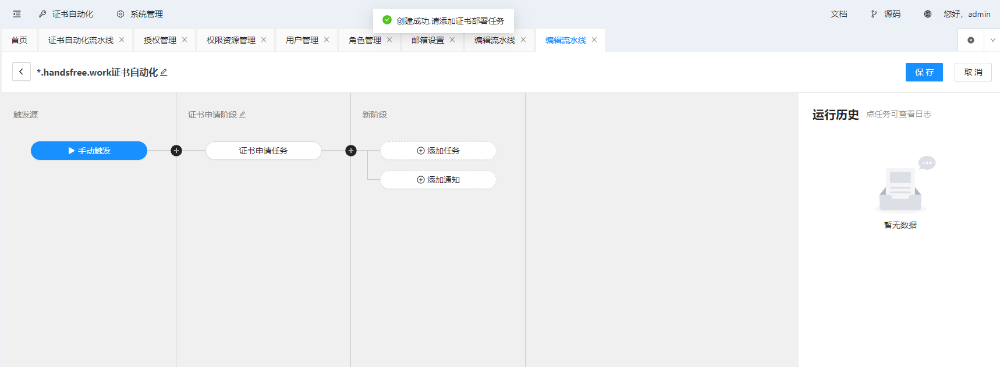

### 2. 任务详情界面

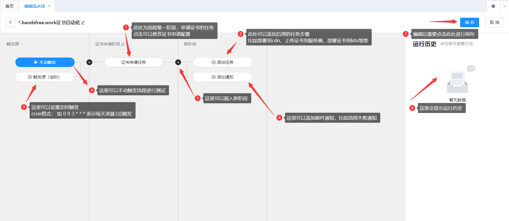

到这一步申请证书就已经配置完成了。 
点击手动触发，就可以申请证书了。

接下来演示如何添加部署任务

### 3. 添加部署到阿里云CDN任务
点击添加任务

选择任务类型

填写任务参数

点击确定，部署到CDN任务配置成功

### 4. 添加部署到服务器主机任务
点击新任务，弹出添加任务界面
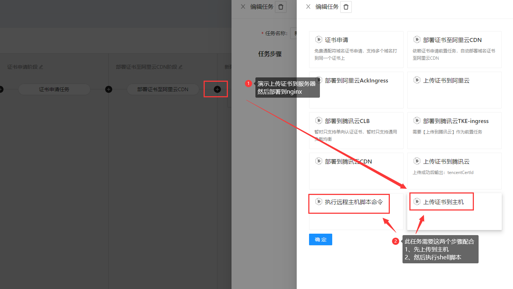
先选择上传到主机任务

填写任务参数，比如证书保存路径
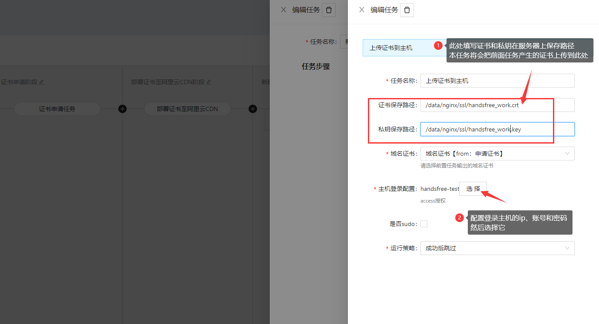

需要添加主机ip、用户名、密码，只需添加一次，后续其他任务可以复用

然后添加第二个任务，执行主机命令，部署证书
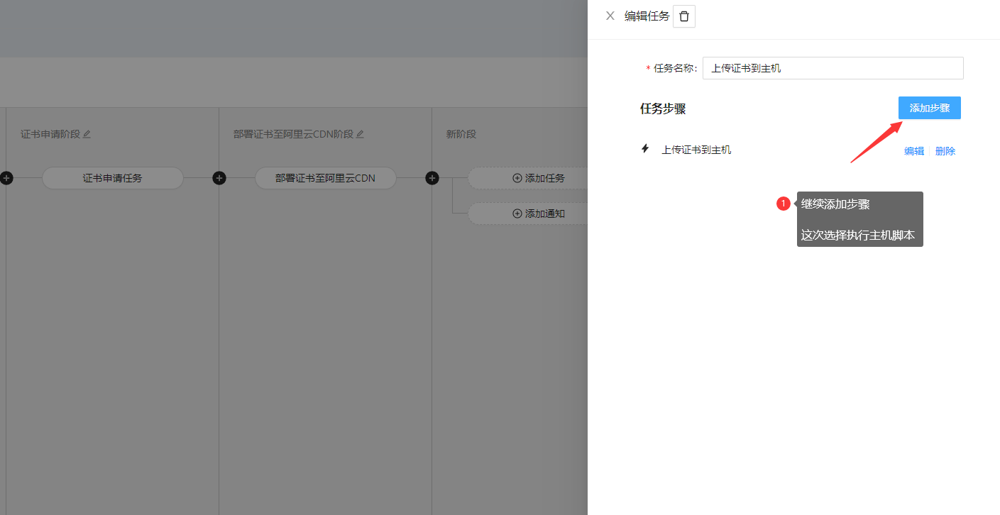

选择执行脚本命令任务

编写脚本，选择之前添加的主机
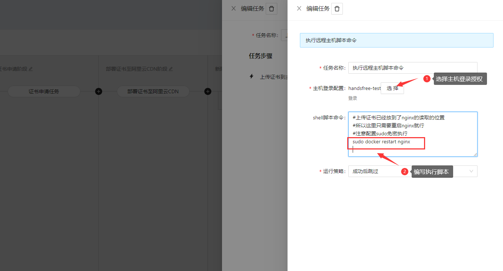

点击确定，部署到主机任务配置成功
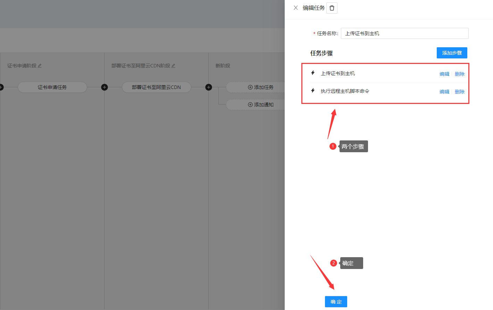

### 5. 手动触发执行任务，测试一下

点击任务可以查看状态和日志

这里执行失败，可以查看错误日志

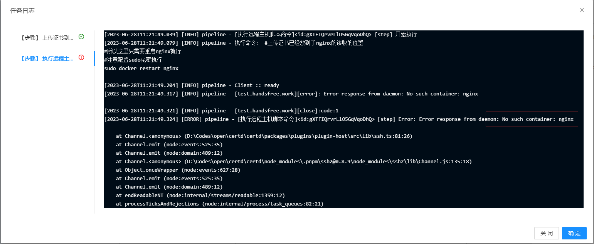

修改正确后，重新执行
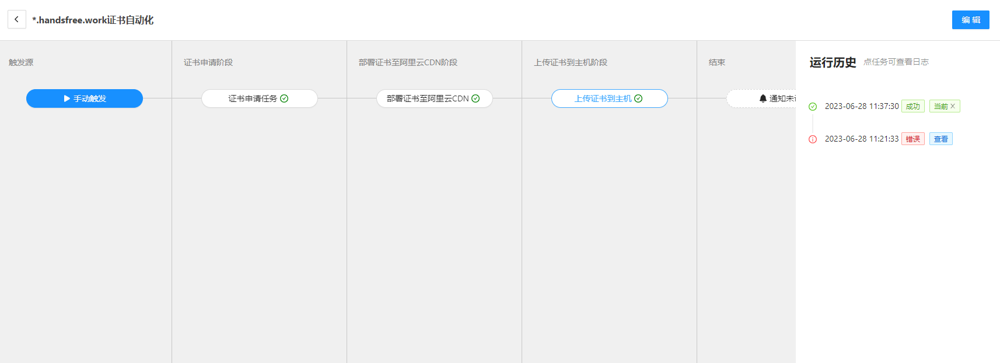
可以看到前面执行过的就会跳过，不会重复执行

### 6. 查看证书部署效果
可以看到证书已经部署到CDN成功

也可以手动下载证书
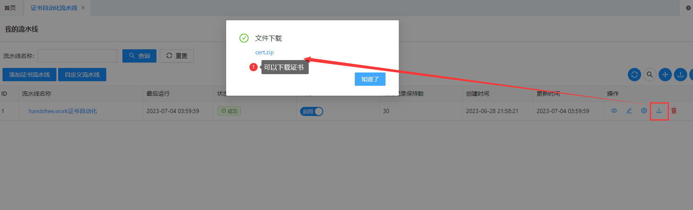

### 7. 定时触发
配置定时触发，以后每天定时执行    
cron格式，例如： `0 0 3 * * *` 表示每天凌晨3点执行     
到期前20天会自动申请新证书并部署，没到期前不会重复申请    

### 8. 邮件通知
可以接收邮件通知（支持时机：开始、成功、失败、失败转成功）
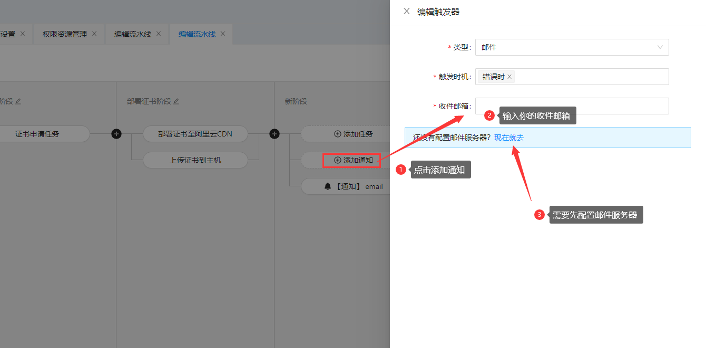
需要配置邮件服务器
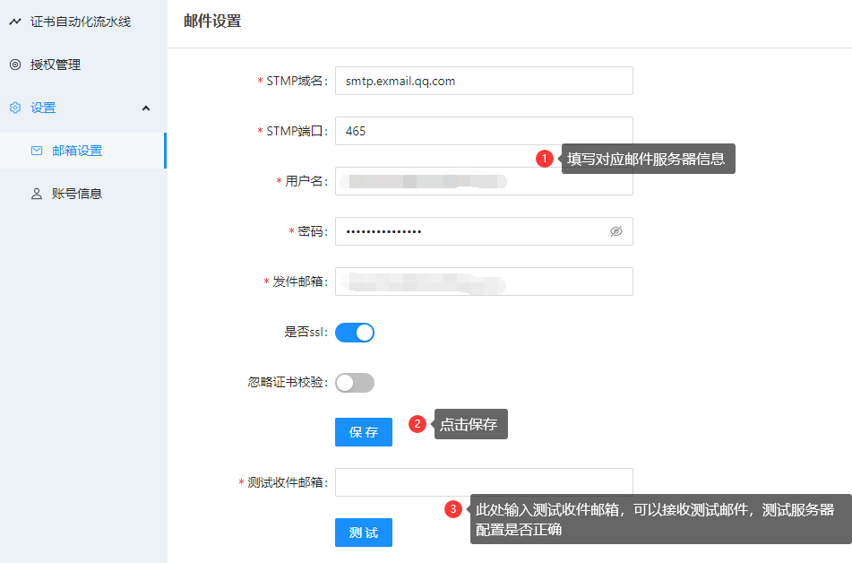

以上，演示了从创建证书申请任务到自动部署证书全流程。   

如有疑问，欢迎加入群聊（请备注certd）
* QQ群：141236433
* 微信群：   
  

